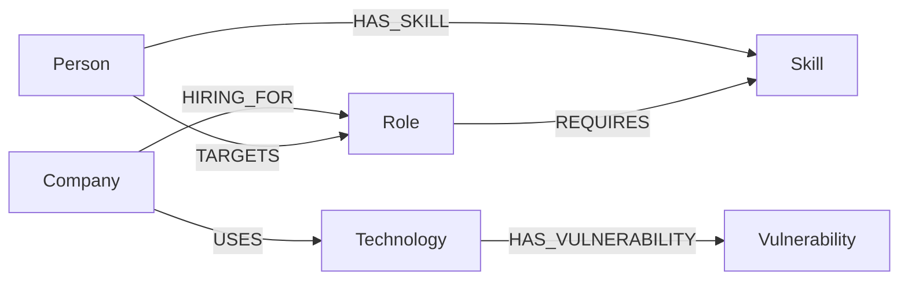

# SkillGraph AI

   

Professional knowledge-graph explorer for career data, skills, roles and company-technology relationships.

---

## Project Overview

SkillGraph AI is a full-stack web application that visualizes a career knowledge graph (people, skills, roles, companies, technologies, vulnerabilities) and provides role recommendations, analytics and a career assistant. The frontend is an interactive single-page app built with React and React Flow; the backend is an Express API that queries a Neo4j graph database and exposes endpoints consumed by the UI.

Key capabilities implemented in this repository:

- Interactive graph visualization (React Flow) with pan/zoom, minimap and node details
- Person selector and search to focus the graph on an individual and their immediate neighborhood
- Recommendations engine that computes role matches and missing skills for a person
- Analytics endpoints (counts and breakdowns for skills, companies, roles, technologies)
- Career Assistant and Profile pages powered by Neo4j queries

---

## Why a Graph Database?

Graph databases (Neo4j / CognoDB Cloud) are a natural fit for connected, relationship-first data such as people, skills and roles. Compared to a relational database, a native graph engine provides:

- Fast multi-hop traversal without expensive joins
- Intuitive modelling of entities and relationships
- Flexible schema for evolving ontologies (new node labels / relation types)
- Built-in algorithms for path-finding, similarity, and neighborhood analysis

Example model (conceptual):

- Person nodes connected to Skill nodes via HAS_SKILL
- Role nodes connected to Skill nodes via REQUIRES
- Company nodes connected to Technology nodes via USES

Why this matters:

- To compute "roles a person can target" the system performs multi-hop traversal: Person -> HAS_SKILL -> Skill <- REQUIRES <- Role. A graph query finds roles with overlapping skills quickly without complicated JOINs.
- To suggest hiring companies for a role: Role <- HIRING_FOR <- Company and Company -> USES -> Technology allows traversal for recommendation signals across two hops or more.

Small example (natural language):

- Find roles that require the same skills a person already has (Person -> HAS_SKILL -> Skill <- REQUIRES <- Role)
- Find companies using technologies related to a person's skills (Person -> HAS_SKILL -> Skill -> (related Technology) -> Company)

---

## Features

The application implements the following features (as found in the codebase):

- Dashboard — overview page with the interactive graph and quick metrics
- Interactive Graph — React Flow rendering of nodes and edges with node details
- Person Selector — choose Sailu, Naveen, Srujitha (or other Persons) to focus the graph
- Skills Explorer — list and analytics for Skill nodes
- Companies — Companies listing and basic insights
- Roles — Roles listing and required-skill mapping
- Recommendations — role-match recommendations for a selected person
- Analytics — aggregated counts and breakdowns for graph categories
- Career Assistant — guidance based on missing skills and recommended learning steps
- Profile — person-centric view
- Search — quick node search in the graph view
- Graph Visualization — minimap, fit-to-view, pan, zoom, and node highlighting

---

## Tech Stack

- Frontend
  - React 18 (Vite) + React Router
  - React Flow for interactive graph rendering
  - Axios for API requests
  - Chart.js / react-chartjs-2 for charts

- Backend
  - Node.js + Express
  - neo4j-driver (official Neo4j JavaScript driver)
  - Simple controller/service structure that uses parameterized Cypher

- Database
  - Neo4j (AuraDB / CognoDB Cloud compatible)

- Graph Library
  - reactflow (official React Flow)

- Charts
  - chart.js + react-chartjs-2

- Styling
  - Inline styles with design tokens; no CSS framework required

- Deployment
  - Frontend: Vercel (static deployment)
  - Backend: Render (or any Node host)

---

## Architecture

The application follows a straightforward two-tier architecture:

Frontend (React SPA)
  ↓ (REST)
Express API (Node.js)  — controllers & services
  ↓ (neo4j-driver)
Neo4j JavaScript Driver
  ↓
CognoDB Cloud (Neo4j AuraDB compatible)

Key components:

- frontend/src/components/GraphView.jsx — interactive React Flow implementation
- backend/config/neo4j.js — driver initialization (reads env vars)
- backend/services/neo4jService.js — small wrapper for session-run and parameterized queries
- backend/controllers/* — controllers that implement /api endpoints consumed by the UI

---

## Graph Data Model (Mermaid)



---

## Main Cypher Queries (examples and explanation)

The backend exposes a set of read-only queries. Below are the most important queries used by the application, taken from the controller implementations:

1) Graph payload for the React Flow view (backend/controllers/graphViewController.js)

```cypher
MATCH (a)-[r]->(b)
RETURN
  elementId(a) AS sourceId,
  labels(a)[0] AS sourceType,
  a.name AS sourceName,
  type(r) AS relation,
  elementId(b) AS targetId,
  labels(b)[0] AS targetType,
  b.name AS targetName
```

- Purpose: returns a flattened edge list and deduplicated nodes derived from all relationships. The controller converts elementId(...) values to stable string ids and builds nodes/edges for React Flow.

2) Person's skills (used for the recommendations flow)

```cypher
MATCH (p:Person {name: $name})
OPTIONAL MATCH (p)-[:HAS_SKILL]->(s:Skill)
RETURN p, collect(distinct s.name) AS personSkills
```

- Parameterized: `$name` is provided by the controller to avoid injection and enable query plans caching.

3) Roles and required skills (recommendations)

```cypher
MATCH (r:Role)
OPTIONAL MATCH (r)-[:REQUIRES]->(sk:Skill)
RETURN r.name AS roleName, collect(distinct sk.name) AS requiredSkills
```

- Purpose: controller loads required skills for each role and computes a match percentage in application logic.

4) Analytics overview (aggregates)

```cypher
MATCH (n)
WITH count(n) AS totalNodes
MATCH (p:Person) WITH totalNodes, count(p) AS persons
MATCH (s:Skill) WITH totalNodes, persons, count(s) AS skills
... -- truncated for brevity
RETURN persons, skills, roles, companies, technologies, vulnerabilities, relationships
```

Why graph traversal is powerful

- Multi-hop queries are expressed naturally and run efficiently in graph engines. For example, to find roles related to a person via shared skills you can traverse: (Person)-[:HAS_SKILL]->(Skill)<-[:REQUIRES]-(Role) in a single query or combine small queries and post-process results in-app.

---

## Screenshots

> Replace these placeholders with production screenshots before publishing the repository.

- Dashboard
  - 

- Graph
  - 

- Analytics
  - 

- Recommendations
  - 

- Career Assistant
  - 

- Profile
  - 

---

## Installation (local)

1. Clone the repository

```bash
git clone <repo-url> skillgraph-ai
cd skillgraph-ai
```

2. Install frontend and backend dependencies

```bash
cd frontend
npm install
cd ../backend
npm install
```

3. Configure environment variables

- Copy `backend/.env.example` → `backend/.env` and provide NEO4J_URI, NEO4J_USERNAME and NEO4J_PASSWORD (do not commit secrets).
- Copy `frontend/.env.example` → `frontend/.env` and set VITE_API_URL if the backend runs on a non-default host.

4. Run the backend

```bash
cd backend
npm start
```

5. Run the frontend

```bash
cd frontend
npm run dev
```

Open the app at: `http://localhost:3000` (Vite default)

---

## Environment Variables (.env.example)

`backend/.env.example`

```env
PORT=5000
NODE_ENV=development
CORS_ORIGIN=http://localhost:3000
# NEO4J_URI=bolt://localhost:7687   # example (commented) - do not commit credentials
# NEO4J_URI=bolt+s://<instance>.databases.cognodb.cloud
# NEO4J_USERNAME=neo4j
# NEO4J_PASSWORD=secret
```

`frontend/.env.example`

```env
VITE_API_URL=http://localhost:5000
```

---

## Project Structure

```
skillgraph-ai/
├── backend/
│   ├── config/
│   │   └── neo4j.js           # driver initialization (reads env vars)
│   ├── controllers/          # API controllers (graph, person, recommendations, analytics, etc.)
│   ├── routes/               # Express route wiring
│   ├── services/             # neo4jService.js wrapper
│   ├── database/             # cypher seed/schema file (schema.cypher)
│   ├── package.json
│   └── server.js
├── frontend/
│   ├── src/
│   │   ├── components/
│   │   │   └── GraphView.jsx  # React Flow integration and graph rendering
│   │   ├── services/api.js
│   │   └── pages/             # other SPA pages (Dashboard, Recommendations, Profile...)
│   ├── package.json
│   └── vite.config.js
├── README.md
└── .env.example
```

---

## Future Improvements

Realistic next steps without breaking existing features:

- Add a lightweight seed runner (npm script) that can safely load `database/schema.cypher` into a configured Neo4j instance using the driver.
- Add an optional startup health-check that runs `driver.verifyConnectivity()` and fails with a helpful message when env vars are misconfigured (the code already attempts this on server start).
- Add role-similarity algorithms (graph algorithms) for better recommendations.
- Add unit and integration tests for controllers and React components.
- Add authentication and per-user preferences (so multiple users can save views).

---

## Assignment Mapping (WEXA AI CognoDB)

| Requirement | Status | Notes |
|---|---:|---|
| Use a real CognoDB Cloud instance | PASS (requires env) | backend/config/neo4j.js validates CognoDB-style URI; set NEO4J_URI, NEO4J_USERNAME, NEO4J_PASSWORD to connect. |
| Connect using official Neo4j JS driver | PASS | `neo4j-driver` is used in `backend/config/neo4j.js` |
| Read credentials from environment variables | PASS | All credentials are read from process.env in config/neo4j.js |
| Never hardcode URI/username/password | PASS | No secrets in code; `.env.example` contains commented examples only |
| Use parameterized Cypher queries | PASS | Controllers use `runReadQuery(cypher, params)` (examples in `recommendationController.js`) |
| Handle DB connection failures gracefully | PASS | server attempts `verifyConnectivity()` at startup and controllers catch errors and return 500 responses |
| Provide seed/load script for graph DB | PASS | `backend/database/schema.cypher` contains schema and seed statements (run with cypher-shell or provider tooling) |
| Application reads live data from DB (not local JSON) | PASS | Controllers use neo4jService to run Cypher and return live results |

---

## Demo

- Hosted URL: _TBD_
- Video walkthrough: _TBD_

---

## Deployment (Vercel frontend + Render backend)

This repository is prepared to deploy the frontend as a Vercel static site and the backend as a Render web service. The project already includes `vercel.json` (frontend) and `render.yaml` (Render infrastructure manifest) to simplify deployment. Below are step-by-step instructions and the environment variables required.

High-level steps

1. Create a GitHub (or GitLab) repository and push this project to the `main` branch.
2. Deploy the backend to Render (recommended):
   - Import the repository into Render using the `render.yaml` manifest (Render supports a "Deploy from Repo" flow and will detect `render.yaml`).
   - Add the following Render **Secrets** (do NOT paste them into source):
     - `NEO4J_URI` = bolt+s://<instance>.databases.cognodb.cloud (CognoDB/AuraDB URI)
     - `NEO4J_USERNAME` = <username>
     - `NEO4J_PASSWORD` = <password>
     - `CORS_ORIGIN` = https://<your-vercel-app>.vercel.app
     - `VITE_API_URL` (optional secret used by static Render frontend deployment; if using Vercel for frontend, set VITE_API_URL in Vercel instead)
   - Confirm Render creates a web service named `skillgraph-ai-backend` and that it uses `backend` as the root. The `render.yaml` in the repo uses `npm install` and `npm start`.
   - After creation, open the Render service and set any additional secrets in the dashboard if necessary.

3. Deploy the frontend to Vercel (recommended):
   - Create a new Vercel project and import the repository.
   - In the Vercel project settings -> Environment Variables, set:
     - `VITE_API_URL` = https://<your-render-backend-url>
   - Build & deploy; Vercel will use `frontend/package.json` and `vercel.json` to build the static site.

CORS details

- The backend reads `CORS_ORIGIN` at runtime and uses it for the `cors()` middleware. Set `CORS_ORIGIN` to your Vercel application origin (for example, `https://skillgraph-ai-username.vercel.app`) in Render secrets. This ensures only the frontend origin is allowed rather than using `*`.

Post-deployment verification

1. Wait for Render to finish building and starting the backend; open the Render service URL and verify the health endpoint responds:
   - `GET https://<your-render-backend-url>/health` should return JSON { status: 'ok' }
2. Verify Neo4j connectivity in Render logs — the server attempts `driver.verifyConnectivity()` at startup and will log success or a helpful error message.
3. After backend is running, deploy frontend to Vercel and confirm the site loads.
4. Verify API endpoints from the frontend (or using curl/postman):
   - `GET https://<your-render-backend-url>/api/graph`
   - `GET https://<your-render-backend-url>/api/persons`
   - `GET https://<your-render-backend-url>/api/skills`
   - `GET https://<your-render-backend-url>/api/companies`
   - `GET https://<your-render-backend-url>/api/roles`
   - `GET https://<your-render-backend-url>/api/recommendations/<personName>`
   - `GET https://<your-render-backend-url>/api/analytics/overview`
   - `GET https://<your-render-backend-url>/api/career-advice/<personName>`

Environment variables to set (summary)

- Render (backend) — set as Render **Secrets**:
  - `NEO4J_URI` (e.g. bolt+s://<instance>.databases.cognodb.cloud)
  - `NEO4J_USERNAME`
  - `NEO4J_PASSWORD`
  - `CORS_ORIGIN` (set to Vercel origin e.g., https://skillgraph-ai-username.vercel.app)
  - (optional) `VITE_API_URL` if you use Render static frontend instead of Vercel

- Vercel (frontend) — Environment Variables in Vercel project settings:
  - `VITE_API_URL` = https://<your-render-backend-url>

Security and secrets

- Never commit NEO4J credentials or CORS origin secrets to source control. Use Render secrets and Vercel environment variables.
- The codebase contains `backend/database/schema.cypher` for seeding the graph — run this separately via cypher-shell or CognoDB import tooling against your CognoDB instance if you need seed data.

Automating deployment

- Render: the included `render.yaml` config (now requiring `CORS_ORIGIN` as a secret) can be imported by Render to create services and environment variables automatically.
- Vercel: `vercel.json` is present to set a static build configuration; link your repo in Vercel and add the `VITE_API_URL` environment variable in project settings.

---

## Live URLs and manual steps (you must provide these values)

- Frontend (Vercel) URL: https://<your-vercel-app>.vercel.app  — set this in Render `CORS_ORIGIN`.
- Backend (Render) URL: https://<your-render-backend>.onrender.com — set this in Vercel `VITE_API_URL`.

I cannot perform the external deployment from this environment. To complete the deployment please perform the following manual steps (concise):

1. Push the repository to GitHub and ensure `main` branch is up-to-date.
2. In Render:
   - Import repo and choose to use `render.yaml` or create a new Web Service for `backend` and a Static Site for `frontend`.
   - Add secrets: `NEO4J_URI`, `NEO4J_USERNAME`, `NEO4J_PASSWORD`, `CORS_ORIGIN`, and optionally `VITE_API_URL`.
   - Deploy and check service logs for successful `verifyConnectivity()` output.
3. In Vercel:
   - Import repo and create a project for the `frontend` folder.
   - Add Environment Variable `VITE_API_URL` set to your Render backend URL.
   - Deploy and open the Vercel URL.
4. Test end-to-end (open frontend and verify graph, analytics, recommendations, career assistant).

---

## What I changed (deployment-related)

- Updated `render.yaml` to read `CORS_ORIGIN` from a Render secret instead of using `*`. This is a minimal security/configuration change to ensure production deployments use an explicit origin and to prevent accidental open CORS.
- No application logic or UI was modified.

---

## Manual checklist to finish deployment (copy/paste)

- [ ] Push repo to GitHub
- [ ] Create Render service (import `render.yaml` or create service manually)
- [ ] Add Render secrets: `NEO4J_URI`, `NEO4J_USERNAME`, `NEO4J_PASSWORD`, `CORS_ORIGIN`, `VITE_API_URL` (optional)
- [ ] Confirm backend build succeeds (`npm install` then `npm start`) and `/health` returns OK
- [ ] Create Vercel project (import repo)
- [ ] Add Vercel env var `VITE_API_URL` => `https://<your-render-backend>`
- [ ] Deploy frontend and verify site loads
- [ ] Verify endpoints listed above respond with expected data

---

## Author

Sailu Chittala

- GitHub: https://github.com/sailuchittala
- LinkedIn: https://www.linkedin.com/in/sailuchittala

---

If you would like this README expanded with live screenshots, a seed-runner script, or an automated health-check script, I can add those in a follow-up commit. Thank you.
